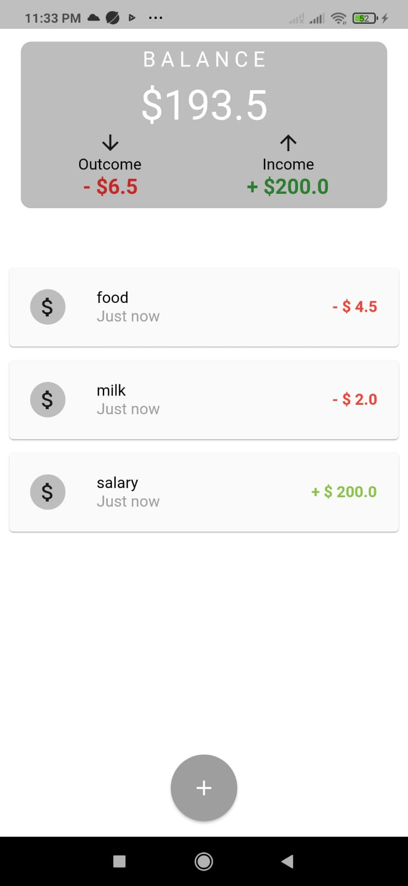
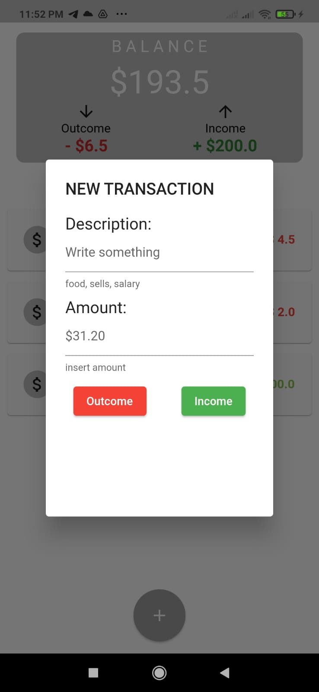
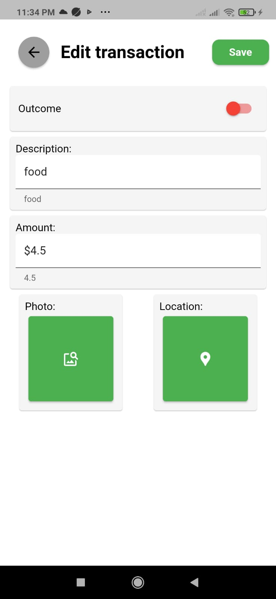
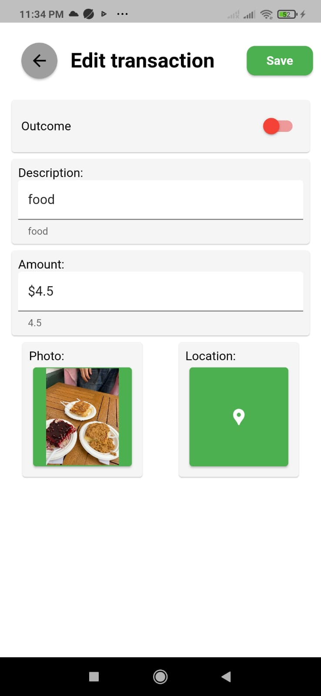

# finance_basic_app_flutter

This is a project I've work for a cuple days, it consist of a personal finance managment app. 

## Getting Started

This project is build and develop in Flutter/Dart, it uses Firebase as data base for images, data and users, also uses RiverPod as StateManager and has a combination of layer and features Arquitecture.

### Sign In/Up

### HomePage

### Create Transaction

### Edit Transaction

